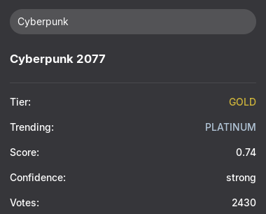

# ProtonDB Checker Indicator

A GNOME Shell extension that allows you to check game compatibility on Linux (Proton) directly from your panel. It uses the Steam API to search for games and the ProtonDB API to fetch compatibility reports.



## Features

* **Search Steam Games:** Quickly find games by name directly from the popup menu.
* **ProtonDB Integration:** View Tier (Platinum, Gold, Silver, etc.), Score, and Confidence levels.
* **Color Coded:** Visual indicators for different compatibility tiers matching ProtonDB's style.
* **Modern Stack:** Built with ESM (ECMAScript Modules) and LibSoup 3 for GNOME 45+.

## Requirements

* GNOME Shell 45 or later.
* `libsoup-3.0` (Standard on most modern distributions).
* `gettext` (Required for building translations).

## Installation

### GNOME Extensions Website

[](https://extensions.gnome.org/extension/9122/protondb-checker/)

### From Source (GitHub)

To install the latest version directly from the source, you need `git`, `gettext`, and `zip`.

1.  **Clone the repository:**
    ```bash
    git clone https://github.com/CarvDev/proton-checker.git
    cd proton-checker
    ```

2.  **Build the extension:**
    Run the build script to compile translations and generate the extension package:
    ```bash
    chmod +x scripts/build.sh
    ./scripts/build.sh
    ```
    *(This will create a `proton-checker.zip` file with all translations compiled).*

3.  **Install the package:**
    Use the standard GNOME tool to install the generated zip:
    ```bash
    gnome-extensions install proton-checker.zip --force
    ```

4.  **Restart GNOME Shell:**
    * **Wayland:** Log out and log back in.
    * **X11:** Press `Alt`+`F2`, type `r`, and hit `Enter`.

5.  **Enable the extension:**
    ```bash
    gnome-extensions enable proton-checker@carvdev.github.com
    ```
## Development & Translations

### Directory Structure
* `extension.js`: Main logic.
* `stylesheet.css`: Styling for the popup menu.
* `scripts/`: Automation scripts for building and translating.
* `locale/`: Compiled translation files (`.mo`) - *Ignored by Git*.
* `po/`: Source translation files (`.po` and `.pot`).

### Updating Translations

We provide a helper script to manage translations automatically. Ensure you have the `gettext` package installed.

**Using the Helper Script (Recommended):**

**1. Update/Create translation files:**

* **To update existing translations:**
    Run the script without arguments. It will update the template (`.pot`) and sync all language files (`.po`).
    ```bash
    chmod +x ./scripts/manage-translations.sh
    ./scripts/manage-translations.sh
    ```

* **To create a NEW translation (e.g., for French):**
    Pass the language code as an argument.
    ```bash
    ./scripts/manage-translations.sh fr
    ```
    **Note:** It's recommended to use the standard POSIX format `ll_CC` (Language_COUNTRY) (e.g `pt_BR`). You can also use the two-letter code (e.g., fr, de) if you want the translation to apply to all regions of that language. However, for languages with major regional differences (like Portuguese), use the full code.
    
    If unsure, check the [GNU Locale Names reference](https://www.gnu.org/software/gettext/manual/html_node/Locale-Names.html) or run `localectl list-locales` in your terminal.

**2. Translate the file:**
Edit the `.po` file created in the `po/` directory using a text editor or a tool like Poedit.

**3. Test Locally (Optional):**
To test your translation in GNOME Shell, you need to rebuild and reinstall the extension.
Go back to the [**Installation > From Source**](#from-source-github) section and repeat **steps 2 to 5** (Build, Install, Restart, Enable).

> **Note:** The compiled translation binaries (`.mo`) generated in the `locale/` folder are for local testing only. Do not commit them to the repository.

<details>
<summary><strong>Click to view Manual Translation Instructions (Advanced)</strong></summary>

Replace `LANG_CODE` from all commands below with your locale. It's recommended to use the standard POSIX format `ll_CC` (Language_COUNTRY) (e.g `pt_BR`). You can also use the two-letter code (e.g., fr, de) if you want the translation to apply to all regions of that language. However, for languages with major regional differences (like Portuguese), use the full code.

If unsure, check the [GNU Locale Names reference](https://www.gnu.org/software/gettext/manual/html_node/Locale-Names.html) or run `localectl list-locales` in your terminal.

1.  **Generate the template:**
    ```bash
    xgettext --from-code=UTF-8 --output=po/proton-checker@carvdev.github.com.pot extension.js
    sed -i 's/charset=CHARSET/charset=UTF-8/g' po/proton-checker@carvdev.github.com.pot
    ```

2.  **Update or Create language file:**
    * *New translation:*
        ```bash
        msginit --input=po/proton-checker@carvdev.github.com.pot --output=po/LANG_CODE.po --locale=LANG_CODE
        ```
    * *Update existing:*
        ```bash
        msgmerge -U po/LANG_CODE.po po/proton-checker@carvdev.github.com.pot
        ```

3.  **Translate the file:**
Edit the `.po` file created in the `po/` directory using a text editor or a tool like Poedit.

4.  **. Test Locally (Optional):**
To test your translation in GNOME Shell, you need to rebuild and reinstall the extension.
Go back to the [**Installation > From Source**](#from-source-github) section and repeat **steps 2 to 5** (Build, Install, Restart, Enable).

> **Note:** The compiled translation binaries (`.mo`) generated in the `locale/` folder are for local testing only. Do not commit them to the repository.

</details>

## License

This project is licensed under the **GNU General Public License v3.0**. See the [LICENSE](LICENSE) file for details.

## Credits

* Data provided by [ProtonDB](https://www.protondb.com/) and [Steam](https://store.steampowered.com/).
* This extension is not affiliated with Valve or ProtonDB.
